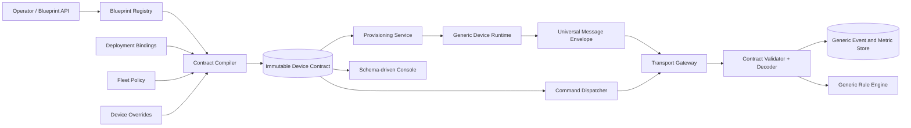

# Device-Blueprint-Driven Extrittio

Status: accepted architecture; foundational implementation in progress

Date: 2026-08-30

## Implementation snapshot

Implemented in the first vertical slice:

- pure `extrittio-device-contract` crate for typed blueprint documents, bounded JSON Schema validation, compatibility checks, deterministic compilation, and SHA-256 contract hashes;
- tenant-scoped blueprint drafts and immutable published revisions on PostgreSQL and Turso, including RBAC and REST/OpenAPI contracts;
- atomic device, shadow, certificate, materialized contract, and desired-assignment creation;
- per-device contract retrieval and convergence acknowledgement on the first valid contract event;
- contract-dispatched Zenoh ingress, universal JSON event envelopes, payload validation, idempotent event storage, and typed metric extraction;
- command input validation and command-route resolution from the materialized contract;
- contract-defined metric queries, generic telemetry presentation, and blueprint-targeted rule fields/actions;
- zero-configuration device creation from a published blueprint, with the platform deriving its Zenoh endpoint from the server address used by the operator and its active listener settings;
- mandatory blueprint contracts for new devices, with firmware-name inference and automatic heartbeat registration removed;
- blueprint-revision-targeted firmware registration, listing, versioning, and OTA eligibility on PostgreSQL and Turso;
- a provisioning-bundle handoff in the console plus a hash-verifying shared Rust runtime loader that derives device identity, Zenoh endpoint, heartbeat timing, and stream routes from the materialized contract.

The fixed telemetry columns, compatibility-only device-type column, and CI firmware/device-type API remain migration surfaces. They should be removed after their consumers run on contract streams, semantics, and blueprint selectors.

## Decision in one sentence

Extrittio should retain a small, stable IoT control-plane kernel and move every domain-specific fact about a device into an immutable, versioned **device blueprint**; when a device is created, the platform materializes a complete **device contract** from that blueprint, platform-owned transport discovery, fleet policy, and device overrides.

This makes Extrittio device-agnostic without making it schema-free.

## What “Extrittio never knows device specifics” should mean

The server and frontend must not contain branches such as:

- if this is a named device family, parse its private metadata keys;
- temperature and humidity are always present;
- every device supports `restart`;
- this device type gets a special chart or command form;
- infer a type by inspecting its firmware name.

Instead, Extrittio knows only universal concepts:

- tenant and device identity;
- authentication and authorization;
- contract version and configuration revision;
- messages, streams, schemas, timestamps, sequence numbers, and acknowledgements;
- desired and reported state;
- command invocation and result correlation;
- connectivity, health, logs, firmware artifacts, and audit events;
- safe limits, delivery semantics, storage, querying, and lifecycle.

The meanings of `temperature`, `valve_position`, `wifi_scan`, `restart`, or `set_flow_rate` are data in a blueprint. The platform validates and operates those declarations using generic engines.

Absolute ignorance is neither possible nor desirable. A platform that does not understand identity, message boundaries, revisions, acknowledgement, and safety limits cannot securely manage a device. The goal is to freeze this universal kernel and keep product/domain vocabulary out of code.

## Current-state findings

The repository already has useful generic foundations, but device knowledge currently leaks through several layers:

- `device_types` contains only `name`, `icon`, and `color_hex`; it is presentation metadata rather than a behavioral contract.
- `DeviceTelemetry` in `crates/common/src/protos/telemetry.proto` fixes temperature, humidity, battery, latitude, longitude, speed, altitude, and heading into the protocol.
- PostgreSQL models, Turso queries, API responses, hourly rollups, and rule evaluation repeat those fixed telemetry fields.
- older ingress code inferred a device family from firmware strings.
- `devices.rs` exposes dedicated restart and location operations, although these are capabilities rather than universal device facts.
- commands accept an arbitrary string-to-string parameter map. The platform cannot discover, render, or validate supported commands.
- `device_configs` stores arbitrary JSON separately from the desired/reported shadow, with no declared schema or device acknowledgement.
- the legacy frontend telemetry path still contains fixed metric profiles.
- the rule compiler recognizes a fixed enum of telemetry fields.
- the Zenoh topic layout is stable and useful, but each message kind has a statically compiled protobuf payload.

These are the seams the blueprint architecture replaces.

## Core concepts

### 1. Device blueprint

A tenant-owned reusable definition of a family of devices. It has a stable identity and human metadata, but no mutable live contract.

Examples might be “Cold-room sensor”, “Organ bath controller”, or “ESP32 network observer”. These examples are user data, not built-in Extrittio concepts.

### 2. Blueprint revision

An immutable published document containing the device’s data streams, schemas, commands, configuration, twin state, health policy, firmware compatibility, relationships, and generic UI presentation.

Drafts may be edited. Published revisions never change. A change creates a new revision and is rolled out deliberately.

### 3. Platform transport binding

The platform maps logical transport names in a blueprint to the transport it already operates. A reusable blueprint says `primary_zenoh`; at device creation Extrittio combines the hostname used to access the server with the active Zenoh scheme and listener port. Operators never type an endpoint into each device.

### 4. Device contract

The immutable effective snapshot assigned to one device:

```text
published blueprint revision
  + automatically discovered platform transport
  + tenant policy
  + fleet configuration overlay
  + per-device configuration overlay
  + generated device identity and secret references
  = signed effective device contract
```

The contract records all resolved endpoints and behavior the device will use. Its canonical JSON bytes have a hash. Both the server and device report that hash, which makes drift observable.

### 5. Contract assignment

A record saying which contract revision a device currently runs, which revision is desired, rollout status, last acknowledgement, and failure reason. Assignments make blueprint evolution as controlled and observable as OTA deployment.

## High-level architecture



The hot path must not interpret arbitrary executable code. Publishing compiles a blueprint into validated lookup tables so ingress performs bounded decoding, schema checks, projection, and routing.

## Blueprint document

JSON should be the canonical stored representation. YAML can be accepted as an authoring format and normalized to canonical JSON before hashing.

The following abbreviated example shows the shape. It is intentionally a platform example, not a built-in device type.

```yaml
apiVersion: extrittio.io/v1alpha1
kind: DeviceBlueprint
metadata:
  key: cold-room-sensor
  name: Cold-room sensor
  icon: thermometer
  color: "#4C90F0"

spec:
  runtime:
    minimumContractApi: 1
    heartbeat:
      interval: 30s
      offlineAfter: 95s
    limits:
      maxMessageBytes: 8192
      maxMessagesPerMinute: 120

  transports:
    - key: primary
      binding: primary_zenoh
      protocol: zenoh
      qos:
        delivery: at_least_once
        ordering: per_device_stream

  routes:
    - key: environment
      transport: primary
      direction: device_to_cloud
      address: extrittio/devices/{device.id}/events/environment
      messageSchema: environment@1
      encoding: json
    - key: command_requests
      transport: primary
      direction: cloud_to_device
      address: extrittio/devices/{device.id}/commands/request
      messageSchema: extrittio.command-request@1
      encoding: protobuf
    - key: command_results
      transport: primary
      direction: device_to_cloud
      address: extrittio/devices/{device.id}/commands/result
      messageSchema: extrittio.command-result@1
      encoding: protobuf

  schemas:
    - key: environment@1
      format: json_schema
      schema:
        type: object
        additionalProperties: false
        required: [temperature, humidity]
        properties:
          temperature: { type: number, minimum: -80, maximum: 120 }
          humidity: { type: number, minimum: 0, maximum: 100 }
          battery_percent: { type: number, minimum: 0, maximum: 100 }
          door_open: { type: boolean }

  streams:
    - key: environment
      route: environment
      timestamp: envelope.occurred_at
      fields:
        - path: /temperature
          type: float64
          label: Temperature
          unit: Cel
          semantic: temperature
          index: true
          aggregates: [min, max, avg]
          presentation: { color: "#4C90F0", chart: line, precision: 1 }
        - path: /humidity
          type: float64
          label: Humidity
          unit: "%RH"
          semantic: relative_humidity
          index: true
          aggregates: [min, max, avg]
        - path: /door_open
          type: boolean
          label: Door
          index: true
        - path: /battery_percent
          type: float64
          label: Battery
          unit: "%"
          semantic: battery_level
          index: true
          aggregates: [min, avg]

  commands:
    - key: identify
      label: Identify device
      description: Blink the status LED.
      danger: normal
      timeout: 10s
      inputSchema:
        type: object
        additionalProperties: false
        properties:
          duration_seconds: { type: integer, minimum: 1, maximum: 30, default: 5 }
      resultSchema:
        type: object
        properties:
          completed: { type: boolean }
      availability: reported.features.identify == true
      idempotency: idempotent

  configuration:
    schema:
      type: object
      additionalProperties: false
      properties:
        sample_interval_seconds:
          type: integer
          minimum: 5
          maximum: 3600
          default: 60
        temperature_offset:
          type: number
          minimum: -10
          maximum: 10
          default: 0
    apply:
      mode: desired_reported
      acknowledgementTimeout: 60s
      atomic: true

  reportedState:
    schema:
      type: object
      properties:
        features:
          type: object
          properties:
            identify: { type: boolean }
        active_config_revision: { type: integer }
        contract_hash: { type: string }

  health:
    signals:
      - key: battery_low
        source: metric
        path: environment./battery_percent
        operator: lt
        value: 15
        severity: warning

  firmware:
    strategy: binary_replacement
    compatibility:
      contractApi: 1
      hardwareRevisionField: reported.hardware.revision

  presentation:
    summary:
      - metric: environment./temperature
      - metric: environment./humidity
    tabs: [overview, telemetry, commands, configuration, logs, firmware]
```

### Required blueprint sections

| Section | Declares | Generic platform behavior |
| --- | --- | --- |
| `runtime` | heartbeat, limits, contract API | liveness, admission limits, compatibility |
| `transports` | logical connections and QoS | bind approved adapters and credentials |
| `routes` | direction, address template, codec, schema | subscribe/publish and dispatch by route key |
| `schemas` | accepted payload structures | validate without compiled device structs |
| `streams` | typed field extraction and retention | query, index, aggregate, chart, and rule inputs |
| `commands` | command names, arguments, result, timeout, risk | form generation, validation, dispatch, audit |
| `configuration` | defaults, constraints, apply/ack semantics | render settings and reconcile desired state |
| `reportedState` | device-owned operational state | validate reports and calculate convergence |
| `health` | declarative health signals | generic health evaluation and alerts |
| `firmware` | strategy and compatibility | eligible-artifact filtering and rollout |
| `relationships` | connection/child schema, if any | topology without device-specific parsers |
| `presentation` | generic cards, charts, tables, actions | schema-driven web and iOS rendering |

Not every section is required for every device. A device with no firmware management or commands simply omits those capabilities.

### IoT capability checklist

The schema should be designed so these concerns can be declared without assuming every device supports them:

| Concern | Examples of declarative data |
| --- | --- |
| Identity | manufacturer ID, serial source, hardware revision, labels, ownership |
| Connectivity | Zenoh/MQTT/HTTP binding, network interface, retry, backoff, QoS, offline buffer |
| Time | clock source, accepted skew, timestamp source, synchronization state |
| Data production | streams, event schemas, sample policy, batch size, compression, retention |
| Data consumption | desired state, commands, jobs, file downloads, acknowledgement behavior |
| Actuation safety | command risk, ranges, interlocks, confirmation, idempotency, timeout |
| Configuration | defaults, validation, mutability, restart requirement, staged/atomic apply |
| Operational state | reported config, active mode, feature flags, counters, diagnostics |
| Health | heartbeat, stale stream, metric thresholds, self-test, degraded reasons |
| Power | mains/battery source, charge metrics, sleep policy, wake schedule |
| Location | fixed/mobile, coordinate fields, accuracy, geofence-compatible semantic tags |
| Relationships | parent/child, gateway/peripheral, observes/controls, external assets |
| Logs and diagnostics | declared structured log attributes, severity, dump/upload capability |
| Firmware | artifact format, hardware compatibility, update strategy, rollback, boot health |
| Security | credential kind, rotation, secure-element support, attestation, secret references |
| Calibration | calibration fields, date, procedure command, certificate/document reference |
| Lifecycle | claim, activate, suspend, reset, transfer, retire, data-erasure behavior |
| Presentation | summaries, units, charts, tables, maps, forms, safe renderer hints |
| Resource budgets | payload/rate/cardinality limits, storage retention, command concurrency |

This is a vocabulary of optional capabilities, not a required mega-document. The compiler emits only the runtime sections a device actually needs.

## Universal wire protocol

Keep one small compiled envelope. Device-specific payloads live inside it and are decoded according to the assigned contract.

```proto
message DeviceEnvelope {
  uint32 protocol_version = 1;
  string device_id = 2;
  string route_key = 3;
  string schema_key = 4;
  uint64 sequence = 5;
  int64 occurred_at_ms = 6;
  string contract_hash = 7;
  string message_id = 8;
  PayloadEncoding encoding = 9;
  bytes payload = 10;
}
```

The transport-authenticated identity is authoritative. `device_id` in the envelope is checked against it, as it is today for topic and protobuf IDs. Tenant identity is never trusted from the payload.

Initially support a deliberately small codec set:

- JSON for easy integration and debugging;
- CBOR for constrained devices;
- dynamically decoded protobuf using a descriptor committed with the blueprint revision;
- raw bytes only for explicitly declared opaque blob streams, never as telemetry fields.

Do not create a plugin or execute uploaded code for every codec. New codecs are reviewed platform adapters. The device-specific schema remains data.

### Logical routes versus physical endpoints

A blueprint declares logical routes and their protocol. The effective device contract contains resolved physical values such as broker locator, topic/path, server CA, client identity reference, QoS, and retry policy. For Zenoh, Extrittio resolves the locator automatically from the HTTP hostname used for device creation and the active Zenoh listener scheme and port.

This split is important:

- the same blueprint can run in cloud, edge, test, and air-gapped deployments;
- production addresses and secrets do not leak into reusable definitions;
- endpoint changes can be rolled out without editing domain schemas;
- arbitrary tenant data cannot turn the backend into an unrestricted network client.

For Zenoh, a v2 topic namespace can remain universal:

```text
extrittio/devices/{device_id}/events/{route_key}
extrittio/devices/{device_id}/control/contract
extrittio/devices/{device_id}/control/config/desired
extrittio/devices/{device_id}/control/config/reported
extrittio/devices/{device_id}/commands/request
extrittio/devices/{device_id}/commands/result
```

The route key is looked up in the assigned contract. A device may not invent a route or publish on a route with the wrong direction.

## Device creation and provisioning

Device creation should become one tenant-scoped transaction plus an out-of-band credential handoff.

### Create request

```http
POST /api/v1/devices
```

```json
{
  "name": "Freezer A-17",
  "blueprint_revision_id": "dbr_01...",
  "fleet_id": 42,
  "configuration": {
    "sample_interval_seconds": 30,
    "temperature_offset": -0.4
  },
  "labels": {
    "site": "warsaw-1",
    "room": "a-17"
  }
}
```

### Atomic server work

1. Authorize the operator and lock all reads to the tenant.
2. Load a published blueprint revision in that tenant.
3. Merge blueprint defaults, tenant policy, fleet overlay, and device override.
4. Validate the result against the blueprint configuration schema.
5. Resolve every Zenoh binding to the server hostname and active listener automatically.
6. Compile stream extractors, command validators, health evaluators, and presentation metadata.
7. Canonicalize, hash, and persist an immutable device contract snapshot.
8. Create the device, initial desired/reported state, contract assignment, audit event, and credential/bootstrap record atomically.
9. Return a one-time claim package or issue the device certificate through the existing secure provisioning flow.

If any step fails, no partially configured device exists.

The current firmware-name-based auto-registration should not survive as an authority path. If discovery is still valuable, an unknown device can create a tenant-scoped, quarantined claim candidate. It may not publish accepted data or receive commands until an operator or an approved claim policy assigns a published blueprint revision and produces a contract.

### First boot

1. The runtime starts with only a device ID, a one-time claim credential, and a fixed bootstrap endpoint or locally provisioned server locator.
2. It authenticates and exchanges the claim for its long-lived identity.
3. It downloads the signed effective contract.
4. It verifies the signature, supported contract API, codecs, and limits before activation.
5. It atomically stores the contract, reconnects using resolved endpoints, and reports `contract_hash` and `active_config_revision`.
6. The platform marks the device `converged` only after acknowledgement.

There must always be one universal bootstrap mechanism. If even bootstrap is arbitrary, a fresh device cannot know where to retrieve its arbitrary configuration.

## Runtime flows

### Telemetry and arbitrary device data

1. The transport gateway authenticates the device and extracts `route_key`.
2. The contract cache resolves `(tenant_id, device_id, contract_hash, route_key)`.
3. The decoder checks encoding and schema, payload size, timestamp skew, sequence, and rate limit.
4. Precompiled JSON pointers or protobuf field paths extract declared stream fields.
5. One transaction persists the raw event, typed points, latest-value projection, and rule outbox actions.
6. Invalid messages go to a bounded rejection/audit record with reason and counters; they do not silently enter telemetry.

The platform stores both:

- the canonical raw event for replay and debugging, subject to retention;
- typed projected points for efficient queries, rules, rollups, and charts.

Storing only JSON is flexible but makes types, indexes, aggregation, and cross-database behavior unreliable. Storing only typed points loses the original event and makes schema evolution harder.

### Commands

Commands become declared operations, not free-form strings.

```http
POST /api/v1/devices/{id}/commands/{command_key}:invoke
```

The dispatcher:

1. finds the command in the device’s assigned contract;
2. checks operator permission plus the command’s risk policy;
3. validates JSON arguments against `inputSchema`;
4. evaluates declared availability against reported state;
5. records the immutable contract revision used for validation;
6. publishes a universal command envelope with correlation and idempotency keys;
7. validates the returned result against `resultSchema`.

The console and iOS app generate command forms from the schema. Bulk operations are available only when every selected device exposes a compatible command key and input schema. `restart` is then an ordinary declared command, not a dedicated backend route.

### Configuration and twin state

Merge the current `device_configs` concept into a typed, revisioned desired/reported reconciliation model:

- `desired.config` is platform-owned and validated against the assigned configuration schema;
- `reported.config` is device-owned and reports what is actually active;
- every desired update gets a monotonically increasing revision;
- the device applies a whole revision atomically and reports success or a structured error;
- secrets appear only as opaque secret references and are delivered over an authorized secret channel, never returned in normal GET responses;
- changing a setting marked `requiresRestart` can optionally enqueue the blueprint’s declared restart command after acknowledgement.

Keep other reported operational state outside config, but validate it with `reportedState.schema`. The generic twin delta algorithm remains useful.

### Health and status

Connectivity status remains universal. Domain health is declarative:

- last-seen and missed heartbeat are kernel signals;
- metric thresholds, stale streams, error counters, and desired/reported drift come from the blueprint;
- a health rule can produce a normalized severity and evidence list;
- global UI and fleet health operate on normalized severity, while details link back to the source metric/path.

### Firmware

Firmware remains a platform capability, but eligibility is contract-driven:

- an artifact declares hardware selectors, supported contract API, compatible blueprint revision range, digest, size, and update strategy;
- a device reports hardware and bootloader facts through declared reported state;
- the generic rollout engine evaluates compatibility rather than equating firmware to a hardcoded device type;
- the existing outbox/supervised worker model should perform delivery and status transitions.

### Relationships and topology

Represent discovery and topology through declared relationship streams. A stream may project records such as:

```json
{
  "relationship": "observes",
  "target_kind": "external_host",
  "target_key": "mac:00-11-22-33-44-55",
  "attributes": { "address": "192.0.2.10", "reachable": true }
}
```

The blueprint defines the relationship schema and identity field. The topology service remains device-agnostic.

## Persistence model

All tenant-owned tables include `tenant_id`; unique constraints and foreign keys must include or verify tenant ownership. PostgreSQL Diesel work remains behind the repository’s blocking boundary, while Turso implements the same domain ports.

| Table | Purpose |
| --- | --- |
| `device_blueprints` | stable tenant-owned blueprint identity and display metadata |
| `device_blueprint_drafts` | mutable authoring document and validation result |
| `device_blueprint_revisions` | immutable canonical document, version, hash, publication state |
| `device_contracts` | immutable per-device resolved contract snapshot and hash |
| `device_contract_assignments` | active/desired contract, rollout state, acknowledgement, error |
| `device_config_revisions` | immutable desired config revisions and status |
| `device_events` | raw validated envelope payload, route, schema, timestamps, sequence |
| `device_metric_points` | typed projected values by stream and field key |
| `device_metric_latest` | current value projection per device/stream/field |
| `device_metric_rollups` | generic interval aggregates per numeric field |
| `command_invocations` | command key, arguments/result JSON, contract revision, lifecycle |
| `device_message_rejections` | bounded diagnostics for invalid or incompatible messages |

`device_metric_points` should use explicit type columns rather than an untyped string:

```text
tenant_id, device_id, stream_key, field_key, occurred_at,
value_type, numeric_value, string_value, boolean_value, json_value,
event_id, schema_key
```

A check constraint allows exactly one value column for the declared type. Numeric rows can be partitioned and indexed by `(tenant_id, device_id, stream_key, field_key, occurred_at)`. Rollups group by those same keys, so adding a metric requires no migration.

The published revision compiler may also populate read-optimized catalogs (`compiled_routes`, `compiled_fields`, and `compiled_commands`) or store an equivalent compiled binary/JSON artifact. These are generated caches, not authored truth.

## Management API

Suggested resources:

```text
POST   /api/v1/device-blueprints
GET    /api/v1/device-blueprints
GET    /api/v1/device-blueprints/{id}
POST   /api/v1/device-blueprints/{id}/drafts
PUT    /api/v1/device-blueprints/{id}/drafts/{draft_id}
POST   /api/v1/device-blueprints/{id}/drafts/{draft_id}:validate
POST   /api/v1/device-blueprints/{id}/drafts/{draft_id}:publish
GET    /api/v1/device-blueprint-revisions/{revision_id}

POST   /api/v1/devices
GET    /api/v1/devices/{id}/contract
POST   /api/v1/devices/{id}/contract-assignments
GET    /api/v1/devices/{id}/contract-assignments
PATCH  /api/v1/devices/{id}/desired-config
GET    /api/v1/devices/{id}/config-revisions

GET    /api/v1/devices/{id}/streams
GET    /api/v1/devices/{id}/streams/{stream}/events
GET    /api/v1/devices/{id}/metrics/{stream}/{field}
POST   /api/v1/devices/{id}/commands/{command}:invoke
GET    /api/v1/devices/{id}/commands
```

The normal device detail response can embed a small `capabilities` summary and contract hash. Large schemas and presentation documents should be separately cacheable by revision hash.

## Generic frontend and iOS behavior

The clients should render from a safe presentation vocabulary, not from arbitrary HTML or JavaScript:

- JSON Schema forms for device configuration and command inputs;
- metric cards, line/step/bar charts, value tables, status badges, maps, and relationship tables;
- visibility predicates over typed state with a small declarative expression grammar;
- standardized unit formatting and semantic hints;
- danger level and confirmation policy for commands;
- empty states when a capability is absent.

Specialized experiences can still exist as optional platform-owned renderers selected by a generic `renderer` key, but the fallback must always work from the schema. A renderer is an optimization, never required to onboard a device.

## Rules engine

Replace the fixed telemetry enum with a typed field reference:

```text
stream_key + JSON/protobuf field path + declared scalar type
```

At rule creation time, resolve the reference against the target blueprint revisions and compile it. At evaluation time, use the already projected typed point; do not repeatedly walk arbitrary JSON.

Rules targeting a fleet with heterogeneous blueprints need an explicit policy:

- require a shared semantic key and compatible type;
- skip devices without the field and report the coverage count; or
- reject the rule as ambiguous.

The recommended default is rejection unless the operator explicitly selects “evaluate only compatible devices”. Command actions must similarly resolve to a declared compatible command.

## Safety and governance

Configuration-driven behavior moves risk from code review to data validation. Publishing a blueprint therefore needs a strong boundary:

- only published, tenant-owned revisions may be assigned;
- route address templates are parsed, normalized, and limited to the assigned device namespace;
- platform-owned transports are the only physical endpoint authority; blueprints select a protocol, not an arbitrary destination;
- outbound HTTP hosts use allowlists, DNS/IP revalidation, redirect limits, and private-network policy to prevent SSRF;
- secret references are tenant-scoped and write-only from ordinary APIs;
- schemas have limits for depth, property count, regex complexity, and decoded size;
- rate, retention, and cardinality budgets are mandatory;
- expression languages are non-Turing-complete and resource bounded;
- no uploaded script, SQL, WASM, or template code runs in the ingress path in the first design;
- every publish, assignment, config change, secret use, and command is audited;
- contract and config rollback retain the last known-good snapshot;
- ingress rejects contract hashes unknown to the authenticated device assignment.

## Versioning and rollout

Three versions must remain distinct:

1. **Envelope protocol version** — rare, platform-wide wire-kernel changes.
2. **Blueprint revision** — device family schema/capability changes.
3. **Device configuration revision** — settings changes within one compatible contract.

Published blueprint revisions are immutable. Classify compatibility during publication:

- additive optional field or new command: usually backward compatible;
- required field, changed type/unit, route, or removed command: breaking;
- presentation-only change: runtime compatible but still revisioned for audit.

Devices pin a contract by default. Assignment supports staged rollout, canary percentage, pause, retry, rollback, and acknowledgement deadline. Never silently mutate every existing device when a blueprint draft is published.

## Proposed migration

### Phase 0 — establish the contract boundary

- Introduce blueprint, revision, contract, and assignment domain ports for PostgreSQL and Turso.
- Define and validate `extrittio.io/v1alpha1`.
- Add a compiler that produces canonical JSON, hash, route lookup, field extractors, command validators, and presentation output.
- Extend current device types into generated legacy blueprints; do not delete current tables yet.

### Phase 1 — generic telemetry alongside v1

- Add the universal envelope and a v2 Zenoh events subscriber.
- Add raw event, typed point, latest, rejection, and generic rollup persistence.
- Generate blueprints for retained device payloads.
- Dual-read in the API, then dual-write or adapt v1 messages at ingress into the generic event model.
- Change the rule engine to typed field references while preserving legacy rule translation.

### Phase 2 — schema-driven console

- Serve capabilities and presentation from blueprint revisions.
- Replace `telemetry-profiles.ts` branches with generic renderers.
- Generate command forms and configuration forms from schemas.
- Replace dedicated restart/location UI with capability and semantic-driven actions/views.

### Phase 3 — contract provisioning and reconciliation

- Make new device creation require a published blueprint revision and resolve the platform transport automatically.
- Materialize an effective contract and initial config in the create transaction.
- Add device contract download, signature/hash verification, acknowledgement, and rollback to shared runtimes and SDKs.
- Converge `device_configs` and shadows into revisioned desired/reported configuration.

### Phase 4 — remove device knowledge

- Migrate firmware compatibility from `device_type_id` to blueprint/contract selectors.
- Remove firmware-name type inference and all device-family-specific persistence/UI paths.
- Stop accepting free-form commands unless a temporary legacy compatibility flag is enabled.
- Remove fixed telemetry columns and v1 protobuf fields only after retention/export compatibility is addressed.
- Enforce a CI check or architecture test that prevents new domain device names in backend/frontend generic layers.

## Alternatives considered

### Put one arbitrary JSON document on each device

Simple initially, but it duplicates definitions, makes fleet-wide evolution difficult, and provides no stable identity for firmware or rules. Use reusable immutable blueprint revisions plus a per-device materialized snapshot.

### Let every device self-describe on first connection

Useful as an import/draft workflow, but unsafe as authority. A compromised device could expand commands, routes, or retention. A device may propose capabilities; an operator-approved published revision remains authoritative.

### Store only opaque messages

Maximally flexible but sacrifices validation, rules, querying, rollups, UI generation, and useful observability. Preserve raw events and also project declared typed points.

### Dynamically create a database column for every field

Produces migration churn, sparse tables, and difficult multi-tenant operations. Use stable generic point tables and selective projections.

### Support arbitrary code plugins immediately

This creates isolation, lifecycle, compatibility, and supply-chain problems before the declarative model is proven. Start with schemas, approved codecs, bounded expressions, and platform-owned adapters.

## Recommended product decisions

1. Rename the product concept from **device type** to **device blueprint**. “Type” can remain a compatibility API term during migration.
2. Make blueprints reusable, but materialize and hash a full per-device contract at creation.
3. Keep a fixed bootstrap path and universal envelope; make everything above that declarative.
4. Use JSON Schema for control-plane authoring and support JSON, CBOR, and dynamic protobuf payloads.
5. Persist raw events plus typed metric projections.
6. Treat configuration as a revisioned desired/reported state with acknowledgement.
7. Pin devices to immutable revisions and roll changes out explicitly.
8. Generate the normal UI from schemas and presentation metadata, with optional safe specialized renderers.
9. Do not allow arbitrary executable transforms in v1 of the architecture.
10. Build generic telemetry and command validation first; firmware generalization can follow once the contract boundary is stable.

## Open questions to resolve before implementation

- Must existing constrained clients support JSON, or should CBOR be the minimum common payload?
- Is dynamic protobuf descriptor decoding worth the flash/tooling cost, or should it be a gateway-side integration option?
- Should blueprint ownership be tenant-only, or can installations expose signed read-only system/catalog blueprints?
- Which configuration overlay layers are required initially: blueprint + device, or blueprint + tenant + fleet + device?
- How much raw-event retention is affordable relative to typed points?
- Should semantic tags use an existing vocabulary such as UCUM for units plus a small Extrittio semantic catalog?
- What is the compatibility relationship between a firmware artifact, hardware revision, and blueprint revision?
- Should legacy clients be adapted indefinitely at the server, or is there a clear v1 protocol retirement window?

## Definition of done

The architecture has succeeded when a tenant can add a completely new device family—with novel telemetry fields, commands, configuration, health checks, firmware constraints, and a useful default UI—by publishing data and flashing a generic-compatible client, without changing or redeploying Extrittio backend or frontend code.
