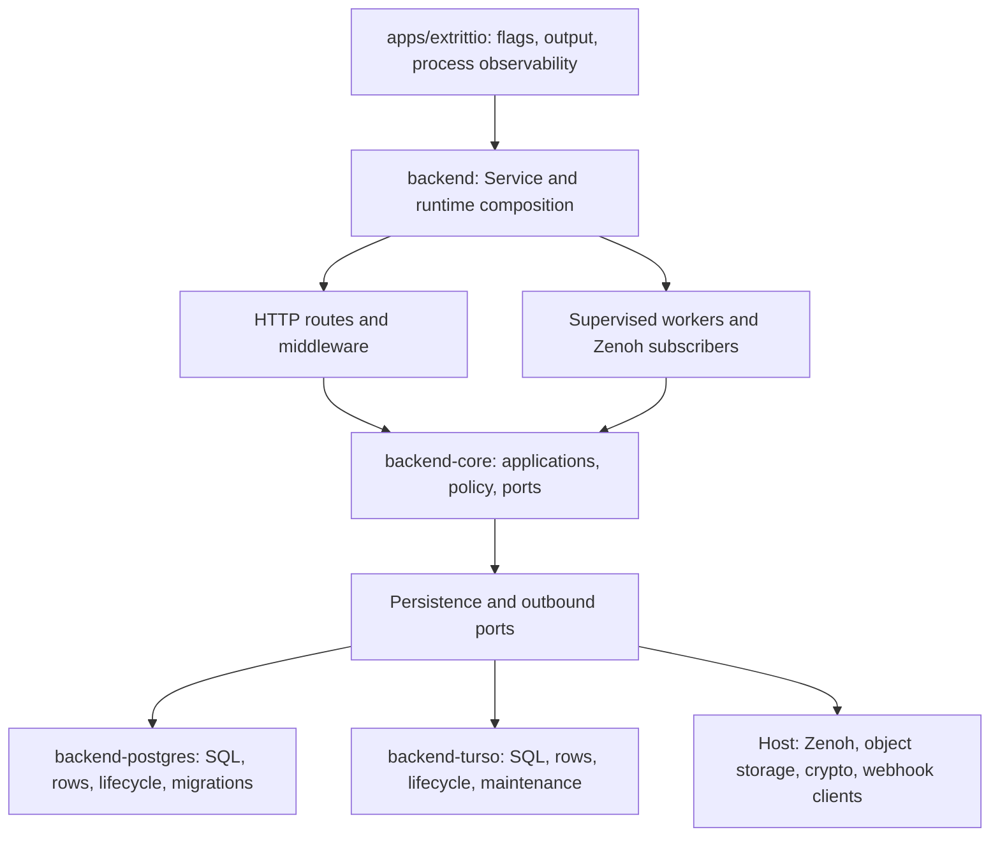

# Backend ownership and upgrade notes

This guide describes the current refactor implementation. Runtime acceptance,
image builds, migration rehearsals, restored-backup checks, and performance
measurements are deferred; see the [execution plan](../design/backend-refactor-execution-plan.md).
Commands below are operator instructions, not actions executed during this audit.

## Runtime ownership

The host chooses one configured adapter and shares its engine handles across
repository implementations and lifecycle operations. AppState retains applications
and private transport/operational substates; it does not retain a business repository
collection. The CLI uses host service operations for initialization, migrations,
maintenance, OpenThread startup, and serving. Backend has no service executable;
its only binary is the explicitly enabled OpenAPI generator.

## Profiles and configuration

| Build | Ownership and intended use |
| --- | --- |
| `cargo build -p extrittio --no-default-features --features production` | PostgreSQL server with production integrations; native allocator selection belongs to the CLI. |
| `cargo build -p extrittio --no-default-features --features edge` | Turso with embedded frontend; build apps/frontend/dist first. Uses the system allocator. |
| `cargo check -p extrittio --no-default-features --features postgres,turso` | Both adapters available for development; configuration still selects exactly one. |
| `cargo check -p extrittio --no-default-features` | Tooling/CLI compile path; requesting a database without its adapter fails explicitly. |

Use `EXTRITTIO_DATABASE_BACKEND` and `EXTRITTIO_DEPLOYMENT_PROFILE` to select the
runtime configuration. PostgreSQL uses `DATABASE_URL` and `DB_POOL_SIZE`. Turso uses
`EXTRITTIO_DATA_DIR`, optional `EXTRITTIO_TURSO_DATABASE_PATH` (defaults to
`extrittio.db` inside the data directory), and `EXTRITTIO_TURSO_BUSY_TIMEOUT_MS`
(default 5000). Validation and explicit CLI overrides remain in config/argument
handling; failures never fall back to another engine. See [Docker](docker.md),
[Edge](edge.md), and [OpenThread](openthread.md) for supported operational commands.

## Migrations and backup ordering

PostgreSQL migration assets live in `crates/backend-postgres/migrations`; Turso
assets live in `crates/backend-turso/migrations`. Adapter lifecycle operations execute
them. Service startup and `extrittio migrate` apply pending migrations. Bootstrap
and certificate initialization follow migration completion.

For Turso, `database info`, `integrity`, `checkpoint`, `backup`, `export`, and
`import` open the database and apply pending migrations first. This includes
`import --dry-run`: it avoids applying archive contents, but is not a promise of
zero schema changes. A backup made by a newer binary may therefore contain its
newer schema. Create the pre-upgrade backup with the currently deployed version
before starting the replacement binary.

`verify-backup` and `restore` do not first open/migrate the target database.
Verification checks the supplied backup; restore verifies before replacement and
requires `--force` when replacing an existing target. Keep the server stopped for
maintenance that acquires its exclusive lock. Preserve firmware objects and key
material alongside the database: a database copy is not a complete service backup.

## Rollback boundaries

No older-binary compatibility is implied by additive SQL alone. Keep the exact
pre-upgrade executable/image, database backup, firmware objects, and encryption
material together. Prefer forward recovery when the old application cannot honor
new durable state; otherwise stop writers and restore a coherent pre-upgrade set.
Do not run down migrations merely to make the schema resemble an old release.

| Slice | Compatibility and recovery boundary |
| --- | --- |
| Identity (R13 / ADR-008) | Pre-epoch tokens intentionally fail closed. Epoch-aware storage and application must move together; rolling back to validation that ignores epochs removes the replacement-principal protection. NUL username rejection changes validation, not stored rows. |
| Certificates/bootstrap/catalog/provisioning (R01–R04) | Preserve key-encryption material and one-time credential semantics. Database rollback must retain matching device credentials and firmware/blueprint objects. Existing configuration reads and atomic JSON merges remain; no configuration acknowledgement/version protocol was added. |
| Rules/alerts/outbox (R05–R06) | New receipt, zone-entry, cooldown-reset, and handoff tables retain delivery/runtime authority. Old queued action readers remain supported by the current implementation. Older workers may ignore that authority; stop mixed-version writers before restoring an older coherent backup. |
| Commands/shadows/ingress/telemetry (R07–R08) | Preserve committed shadow and command state. The telemetry maintenance boundary freezes already-pruned history; reverting to maintenance that ignores it can recompute aggregates from missing raw samples. |
| Firmware (R09) | Metadata/object compensation and OTA transitions rely on matching database state and object storage. Keep artifacts available for outstanding device downloads; database restoration alone cannot recreate deleted objects. |
| Projections and host extraction (R10–R12) | Source moves add no wire format. Recorded ordering, precision, and aggregation corrections are in the decisions/execution plan; older query behavior may differ. CLI output and public schemas are retained. |

The new PostgreSQL runtime migrations are `20260914010000` through
`20260914050000`; Turso equivalents are `0010` through `0014`. They add alert
receipts, zone entries, cooldown reset markers, zone handoffs, and the telemetry
maintenance boundary. Databases with telemetry history initialize the pruning
boundary conservatively at migration time; fresh databases start without a boundary.
No migration or rollback rehearsal has been performed in this refactor session.

## Artifact evidence

Production/edge dependency isolation is checked by `cargo xtask architecture`.
Docker source/manifest layers include all extracted backend crates; offline metadata
inspection of the dummy-source layer resolved all 17 workspace packages. Compilation
and this metadata inspection do not prove Linux linkage, image startup, binary size,
or runtime cost. Comparable release artifacts and platform measurements remain
explicitly deferred; no performance improvement or regression is claimed.
